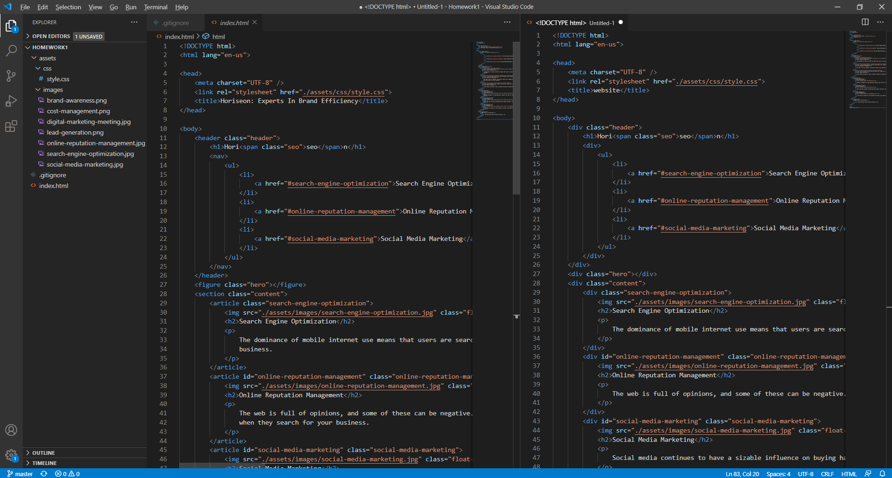
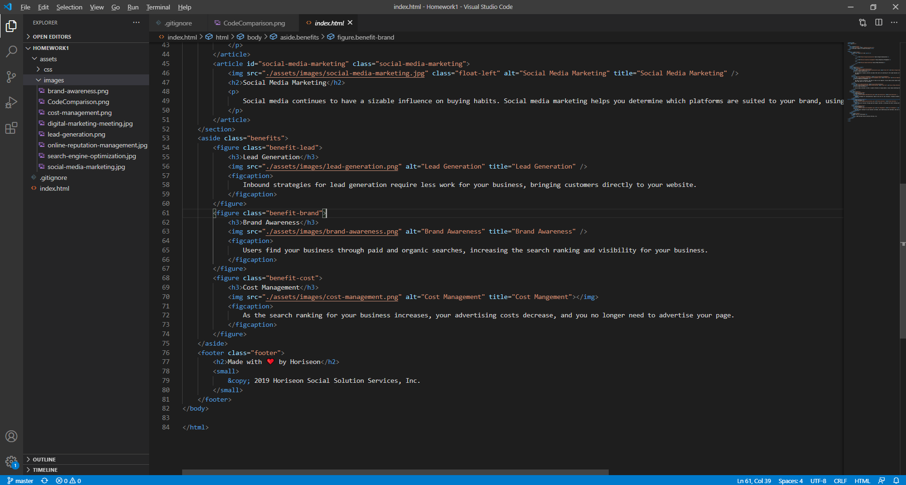

# Homework 1

In this assignment we were tasked to refine the HTML of a pre-existing site to be more semantic and accesible.

## Changes in HTML

Changes included:
* Most divs replaced with more descriptive tags (ie. header, section, aside, etc.)
* CSS partially changes to accomodate new tags.
* alt and title attribtutes added to images to increase accesibility of website.

### Image of semantic HTML and original HTML

### Addition of alt and title attributes to image tags

## Link to Website

https://auslam212.github.io/Homework1/
